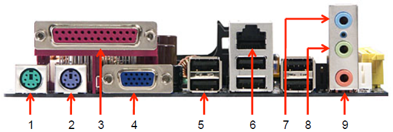
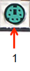
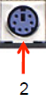
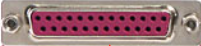
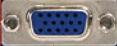

# CONECTORES EXTERNOS DE UNA PLACA BASE

Los conectores externos de la placa base se utilizan para conectar periféricos y pueden agruparse en varias categorías, como los de USB para los dispositivos: los de vídeo para monitores y proyectores, los de audio para altavoces, micrófonos y otros equipos de sonido, los de red para conectarse a internet y los de PS/2 para teclados y ratones.

## PUERTOS PS/2

Sirven para conectar el teclado y el ratón, normalmente las placas incluyen dos puertos PS/2 idénticos, pero el teclado y el ratón se tienen que colocar en su conector que corresponde, así no funcionaría.

* El puerto de color verde es el del ratón.

* El de color lila es el del teclado.

## PUERTO PARALELO

También se les conoce con el nombre LPT o puertos de impresora. La información se envía mediante 8 bits al mismo tiempo en lugar de utilizar un bit como en los serie. Se pueden conectar a ellos las unidades de CD-ROM y DVD-ROM externos o escáneres. Actualmente quedan obsoletos.

## PUERTO VGA

Son puertos de vídeo que se utilizan para conectar el monitor, pantalla de televisión o proyector a la placa base. Actualmente quedan obsoletos.

## PUERTOS USB

Sirven para conectar dispositivos USB como los *Pen Drives* en el equipo.

